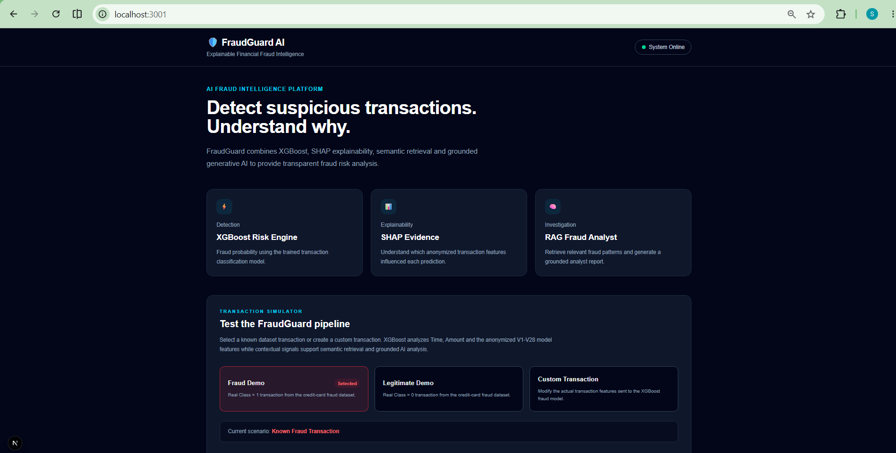

# 🛡️ FraudGuard AI

### Explainable Fraud Detection with XGBoost, SHAP, Semantic Retrieval, and Grounded Generative AI

FraudGuard AI is an end-to-end fraud analysis system that combines **machine learning, explainable AI, semantic retrieval, and grounded generative AI**.

Instead of returning only a fraud probability, FraudGuard provides model explanations, retrieves relevant fraud knowledge, and generates an analyst-friendly report grounded in the available evidence.

> FraudGuard is designed as a decision-support and portfolio/research system, not as a replacement for human fraud investigators.

---

## ✨ Key Features

- 🧠 **XGBoost fraud detection** — predicts transaction fraud probability and risk level.
- 📊 **SHAP explainability** — shows which anonymized transaction features influenced the prediction.
- 🔎 **Semantic retrieval** — uses Sentence Transformers and FAISS to retrieve relevant fraud patterns.
- 🤖 **Grounded AI analyst** — combines model evidence, transaction context, and retrieved knowledge into a structured report.
- 💻 **Interactive dashboard** — supports Fraud Demo, Legitimate Demo, and Custom Transaction analysis.
- 🧪 **Automated testing** — covers API behavior, retrieval, context generation, and RAG grounding rules.

---

## 🏗️ Architecture

```text
                     Transaction
                          │
             ┌────────────┴────────────┐
             │                         │
             ▼                         ▼
     Model Features             Transaction Context
 Time + Amount + V1-V28       channel, velocity, etc.
             │                         │
             ▼                         ▼
          XGBoost                Context Query
             │                         │
       ┌─────┴─────┐                   ▼
       ▼           ▼           Sentence Transformer
  Prediction      SHAP                  │
       │           │                    ▼
       │           │                  FAISS
       │           │                    │
       │           │            Retrieved Knowledge
       │           │                    │
       └───────────┴─────────┬──────────┘
                             ▼
                    Grounded AI Analyst
                             │
                             ▼
                  Structured Fraud Report
```

FraudGuard intentionally keeps **model evidence** and **contextual retrieval evidence** separate until the grounded AI analysis stage.

The XGBoost model uses only:

```text
Time + Amount + V1-V28
```

Contextual signals are used independently for semantic retrieval and grounded reasoning.

---

## 📈 Model Performance

Multiple classifiers were evaluated before selecting XGBoost.

| Model                      |  Precision |     Recall |         F1 |    ROC-AUC | Avg. Precision |
| -------------------------- | ---------: | ---------: | ---------: | ---------: | -------------: |
| Logistic Regression (0.50) |     0.8485 |     0.5895 |     0.6957 |     0.9563 |         0.6923 |
| Logistic Regression (0.10) |     0.8434 |     0.7368 |     0.7865 |     0.9563 |         0.6923 |
| Random Forest              |     0.9718 |     0.7263 |     0.8313 |     0.9239 |         0.7876 |
| **XGBoost**                | **0.9726** | **0.7474** | **0.8452** | **0.9760** |     **0.8312** |

### Final XGBoost Results

| Metric            |     Result |
| ----------------- | ---------: |
| Precision         | **97.26%** |
| Recall            | **74.74%** |
| F1 Score          | **84.52%** |
| ROC-AUC           | **97.60%** |
| Average Precision | **83.12%** |

Because the dataset is highly imbalanced, metrics such as **precision, recall, F1, ROC-AUC, and Average Precision** are more informative than accuracy alone.

---

## 🔎 Semantic Retrieval

FraudGuard converts interpretable transaction context into natural-language queries and embeds them using:

**Sentence Transformers — `all-MiniLM-L6-v2`**

The normalized embeddings are searched against a curated fraud knowledge base using **FAISS**.

The current knowledge base covers patterns including:

- Card-Not-Present Fraud
- Account Takeover
- Card Testing
- Identity Fraud
- Phishing and Social Engineering
- Transaction Velocity Abuse
- Stolen Payment Card Fraud
- Merchant Fraud
- Transaction Laundering
- Unauthorized Payment Fraud

### Retrieval Evaluation

| Metric |           Result |
| ------ | ---------------: |
| Hit@1  | **100% (10/10)** |
| Hit@3  | **100% (10/10)** |
| MRR    |       **1.0000** |

These results come from a controlled evaluation over the current **10-document knowledge base** and should not be interpreted as 100% RAG accuracy on arbitrary real-world queries.

> Semantic similarity represents retrieval relevance, not the probability that a fraud technique occurred.

---

## 🤖 Grounded AI Analysis

The AI fraud analyst combines:

1. XGBoost prediction and fraud probability
2. SHAP model evidence
3. Supplied transaction context
4. Retrieved fraud knowledge

The generated report includes:

- Risk Assessment
- Model Evidence
- Relevant Fraud Context
- Recommended Actions
- Limitations

Grounding rules prevent the system from treating retrieved patterns as confirmed fraud or inventing real-world meanings for anonymized `V1-V28` features.

---

## 💻 Dashboard

FraudGuard provides an interactive Next.js dashboard with three modes:

- **Fraud Demo** — demonstrates high-risk fraud detection.
- **Legitimate Demo** — demonstrates low-risk analysis.
- **Custom Transaction** — allows model features and contextual signals to be modified independently.

### FraudGuard AI Dashboard



Additional screenshots showing fraud detection, SHAP explanations, semantic retrieval, grounded AI analysis, legitimate transactions, and custom analysis are available in `docs/images/`.

---

## 🛠️ Tech Stack

| Layer              | Technologies                                 |
| ------------------ | -------------------------------------------- |
| Machine Learning   | Python, XGBoost, scikit-learn, Pandas, NumPy |
| Explainability     | SHAP                                         |
| Semantic Retrieval | Sentence Transformers, FAISS                 |
| Generative AI      | Groq                                         |
| Backend            | FastAPI, Uvicorn                             |
| Frontend           | Next.js, React, TypeScript, Tailwind CSS     |
| Testing            | pytest                                       |

---

## ⚙️ Quick Start

### 1. Clone the repository

```bash
git clone <YOUR_REPOSITORY_URL>
cd FraudGuard-AI
```

### 2. Create a virtual environment

**Windows**

```bash
python -m venv .venv
.venv\Scripts\activate
```

**macOS / Linux**

```bash
python -m venv .venv
source .venv/bin/activate
```

### 3. Install backend dependencies

```bash
pip install -r requirements.txt
```

### 4. Configure the Groq API key

Create a `.env` file in the project root:

```env
GROQ_API_KEY=your_api_key_here
```

Never commit API keys or secrets to Git.

### 5. Start the backend

```bash
uvicorn src.fraudguard.api:app --reload
```

The API runs at:

```text
http://127.0.0.1:8000
```

### 6. Start the frontend

Open another terminal:

```bash
cd frontend
npm install
npm run dev
```

Open the localhost address shown by Next.js.

---

## 🧪 Testing

Run the backend test suite from the project root:

```bash
python -m pytest -v
```

Tests cover:

- API behavior
- transaction-context generation
- semantic retrieval
- RAG prompt construction
- analysis-mode selection
- grounding constraints

Retrieval evaluation can also be run with:

```bash
python evaluate_retrieval.py
```

---

## ⚠️ Limitations

- `V1-V28` are anonymized transformed features and do not have known real-world meanings.
- SHAP explains model influence but does not establish the real-world cause of fraud.
- Semantic retrieval identifies related knowledge, not confirmed fraud techniques.
- The current retrieval knowledge base and evaluation set are intentionally small.
- LLM-generated analysis should be reviewed by a human investigator.
- The system is a portfolio/research project and is not intended for production financial decision-making.

---

## 👤 Author

**Sejal Dongre**

Built as an end-to-end AI/ML engineering portfolio project demonstrating:

**Machine Learning · Explainable AI · Semantic Search · RAG · Generative AI · FastAPI · Next.js · Automated Testing**

---

## 📄 Disclaimer

FraudGuard AI is intended for **educational, research, and portfolio demonstration purposes**.

It should not be used as the sole basis for financial decisions, fraud accusations, account restrictions, or other high-impact actions.
